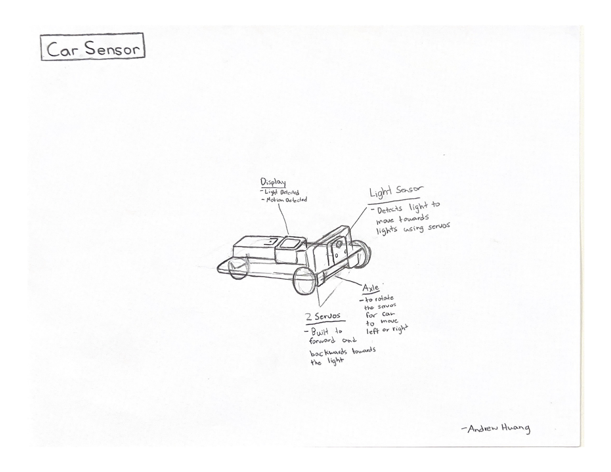
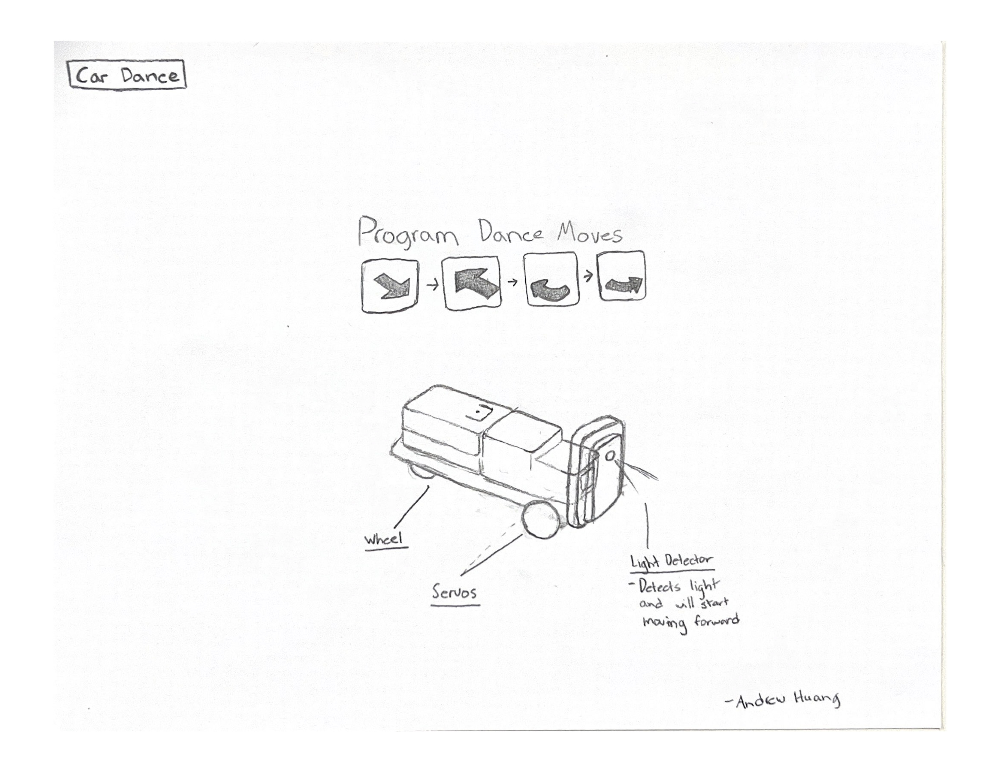
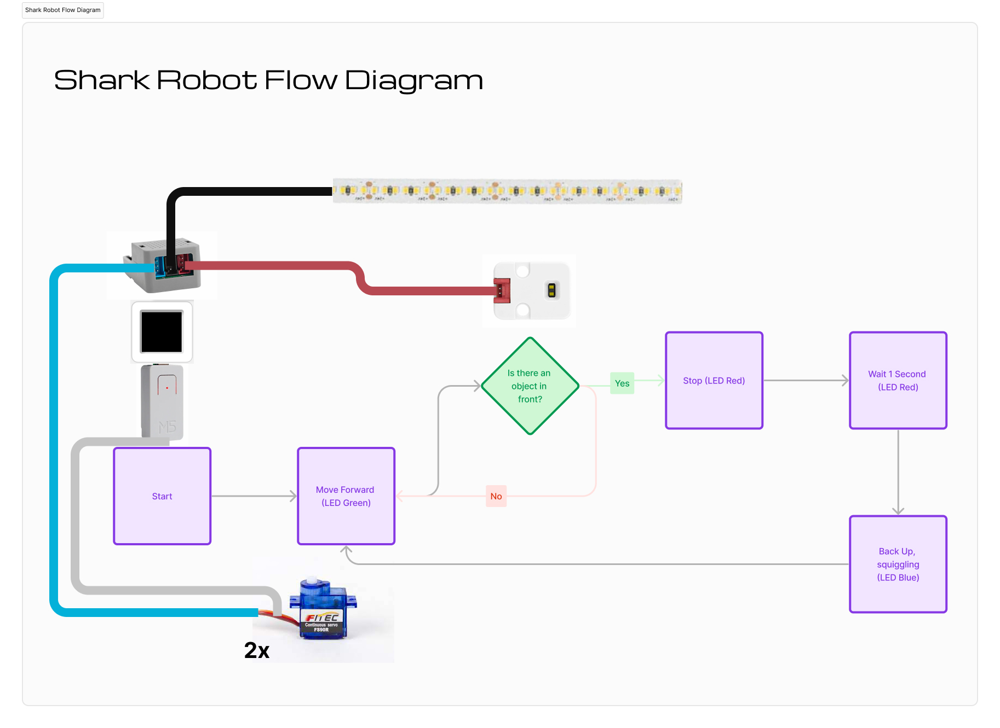

# Spaceship Shark Robot
## Introduction
After exploring servos and sensors, I wanted to learn how to build a vehicle that moves and detects objects and responds based on the object detection. So I began sketching two different ways for the vehicle to trigger responses.

### Sketch 1: 

I ended up following the concept of using two servos as front wheels with a rolling back wheel to minimize space while enabling the vehicle to move forward, backward, turn left, and right. I also implemented sensors to enable the vehicle to respond to objects. Initially, I explored the light sensor, but ultimately chose a distance sensor for its practicality in detecting objects within a room environment.

### Sketch 2: 

```
if program_state == 'DANCE':
    random_num_1 = random.randint(20, 140)
    random_num_2 = random.randint(20, 140)
    for i in range(3):
      servo.move(random_num_1)
      servo1.move(random_num_2)
      time.sleep_ms(100)
      servo.move(90)
      servo1.move(90)
```
I wanted the robot to dance in a sequence because I wanted to learn how to control the robot vehicle's direction. I even tested a prototype of the vehicle with servos moving in random directions. I combined this dancing direction of the robot with the moving vehicle sensor by implementing two states: 1. program_state = 'DANCE' to dance, 2. program_state = 'ON' to move forward detecting light.

## Implementation


MVP Video Demo: [v0.MOV.zip](https://github.com/1andreh/-SP24-IXD256-AndrewHuang/files/15048859/v0.MOV.zip)  
In order for my vehicle to move, I connected my servos and light sensors to AtomS3, using UIflow to connect the input and output through code. I utilized an extension battery pack to enable the vehicle to move freely. The MVP of this vehicle has two states: moving forward, detecting light, and stopping when no light has been detected, and the second state allowing it to dance.

### Hardware
* **20lb Pink Foam Shark Model** - case for the electronic firmware to go inside with a refined design of a spaceship shark
* **Rubber Tires** - keeps traction for the wheels to turn the robot, preventing the vehicle from slipping
* **Bottom Cover** - clear acrylic cover screwed onto the bottom, covering the electronics inside the shark robot
* **Lego Connectors** - connects the firmware to the pink foam


### Firmware


#### Servos
* **Left Servo** - moves the left wheel of the vehicle.
* **Right Servo** - moves the right wheel of the vehicle.

```
if program_state == 'ON':
    if distance < 5.0:
        print("DETECTED")
        program_state = 'STOP'
    else:
        servo.move(65)
        servo1.move(120)
```
As long as the distance sensor detects no objects in front of the vehicle, the servos will move, causing the shark robot to move forward. The servos have different movement values based on the various states the robot is in.

#### Distance Sensor
* **Distance Sensor** - The vehicle detects the distance of objects in front of the sensor, changing program states when detecting an object close to the sensor, switching the vehicle's program_state to 'BACKUP' when an object is detected.
```
    distance = tof_0.get_distance()
    print(distance)
    if distance < 5.0:
        # DETECTED
    else:
        # NOT DETECTED
```
The program checks to see whether the distance sensor has detected any objects close (i.e. less than the value of 5.0). The program will continuously loop to check if any objects are detected in front of the vehicle.

#### LED Strip
* **LED Strip** - changes colors based on program state, 'ON', 'STOP', 'BACKUP'.
```
if program_state == 'STOP':
    c = get_color(255, 0, 0) # red color
    rgb.fill_color(c)
if program_state == 'BACKUP':
    c = get_color(0, 0, 255) # blue color
    rgb.fill_color(c)
    c = get_color(0, 255, 0) # green color
if program_state == 'ON':
    rgb.fill_color(c)
```
based on each state, the LED color is changed on the LED strip to signify that the vehicle is in a certain state. For example, on 'STOP' state, the color of the vehicle's LED light turns red.

* **M5 Battery Pack** - allows the robot to become wireless and move anywhere on flat surface.
* **M5 Extension** - allows AtomS3 to receive four unit inputs instead of one unit.

### Software
#### State Highlights
##### State: ON
```
    distance = tof_0.get_distance()
    print(distance)
    time.sleep_ms(100)
    
    if program_state == 'ON':
        if distance < 5.0:
            print("DETECTED")
            program_state = 'STOP'
        else:
            servo.move(65)
            servo1.move(120)
            time.sleep(1)
            time.sleep_ms(100)
            c = get_color(0, 255, 0) # green color
            rgb.fill_color(c)
        label1.setText('Press to')
        label2.setText('Turn Off')
```
When the vehicle does not detect an object (i.e. the value greater than 5.0) it will move forward continuously. The LED turns green when the vehicle is moving forward while it's in 'ON' state. When the vehicle detects an object close (i.e. the value less than 5.0), it will change to program_state = 'STOP'. 

##### State: STOP
```
elif program_state == 'STOP':
    c = get_color(255, 0, 0) # red color
    rgb.fill_color(c)
    servo.move(90)
    servo1.move(90)
    time.sleep_ms(2000)
    program_state = 'BACKUP'
    print("program_state: ", program_state)
```
When the vehicle is in STOP, it the servos stop moving for 2 seconds, then changes states to 'BACKUP'. The LED changes color to red during state 'STOP'.

##### State: BACKUP
```
elif program_state == 'BACKUP':
    c = get_color(0, 0, 255) # blue color
    rgb.fill_color(c)
    print("back up..")
    servo.move(105)
    servo1.move(75)
    time.sleep_ms(3000)
    program_state = "LOOKING"
    print('program_state =', program_state)
```
Once in state of 'BACKUP', the LED light turns blue, and the servos move the vehicle in reverse, away from the object it has detected. After 3 seconds of moving in reverse direction, the vehicle's state changes to 'LOOKING'.

##### State: LOOKING
```
elif program_state == "LOOKING":
    #distance = tof_0.get_distance()
    if(distance) < 5.0:
        print("looking for space.. ", distance)
        servo.move(75)
        servo1.move(70)
        time.sleep_ms(500)
    else:
        print("NO OBSTACLE")
        # stop both servos:
        servo.move(90)
        servo1.move(90)
        program_state = "ON"
        print('program_state =', program_state)
```
Inside program state 'LOOKING', the distance sensor detects for open space without any objects in front of the vehicle. The servos will rotate the vehicle until the sensor has detected an open space for the Robot to move forward. Once the distance sensor detects an open space, the vehicle's program state will change to 'ON'.


### Integrations

#### HTTP Web Server 
```
if program_state == 'OFF':
    # code to create web server and connect to wifi
    s = socket.socket(socket.AF_INET, socket.SOCK_STREAM)
    s.bind(('', 80))
    s.listen(5)

    ssid = 'WIFI_NAME'
    password = 'PASSWORD'

    wifi = network.WLAN(network.STA_IF)
    wifi.active(True)
    wifi.connect(ssid, password)

    print('connect to WiFi...')
    while wifi.isconnected() == False:
      print('.', end='')
      time.sleep_ms(100)

    print('WiFi connection successful')
    print(wifi.ifconfig())
    
    ip_list = wifi.ifconfig()
    ip_address = ip_list[0]
    # finished connecting to wifi
```
I learned how to connect the vehicle with HTTP web server to control the vehicle through web browser on any devices. Using the tutorial from Nikita, the code connects to an ip address through WIFI, printing out the ip address to connect to the vehicle. There were two CTA buttons that allowed the vehicle to change states. 

#### HTML Web Content
```
def web_page():
    global program_state
    html = """
    <html>
        <head>
            <title>Web Server</title>
            <meta name="viewport" content="width=device-width, initial-scale=1">
            <link rel="icon" href="data:,">
            <style>
                html{font-family: Helvetica; display:inline-block; margin: 0px auto; text-align: center;}
                h1{color: #0F3376; padding: 2vh;}
                p{font-size: 1.5rem;}
                .button{display: inline-block; background-color: #e7bd3b; border: none; border-radius: 4px; color: white; padding: 16px 40px; text-decoration: none; font-size: 30px; margin: 2px; cursor: pointer;}
                .button2{background-color: #4286f4;}
            </style>
        </head>
        <body>
            <h1>Web Server</h1> 
            <p>program state: <strong>""" + program_state + """</strong></p>
            <p><a href="/?state=on"><button class="button">ON</button></a></p>
            <!--<p><a href="/?state=off"><button class="button button2">OFF</button></a></p>-->
            <p><a href="/?state=dance"><button class="button button2">DANCE</button></a></p>
        </body>
    </html>"""
    return html
```
The web browser consists of two buttons states that control the program states of the two vehicles.

#### Challenges with Web Server and Approach
```
if BtnA.wasPressed():
  print('button pressed!')
  program_state = 'OFF'
  label0.setColor(0xff2727, 0x000000)
  label0.setText('Status: OFF')
  print(program_state)
  label1.setText('1. ON')
  label2.setText('2. Dance')
  servo.move(90)
  servo1.move(90)
```
Because the server needs to run the line to keep connecting, the vehicle needed to be in program_state = 'OFF' using the AtomS3 displa button in order to press program_state to 'DANCE'. I created a display to provide steps on switching task for a good user experience.

### Mechanical Design


### Outcome
The Robot Shark can have multiple program states, enabling the vehicle to move forward and detect and avoid objects. Furthermore, with states, the Robot Shark can indicate to the audience which state it is currently in through the colors of the LED strip. I learned that the shark required many different pieces of hardware to assemble in order to allow it to move, including the rubber grip for traction and the bottom cover to enclose all the electronics.


### Conclusion
Overall, I am very happy with the assembly of the whole shark and how it was designed and programmed, enabling the vehicle to respond based on the environment using different states. If I had gone back to create the pockets for fitting the electronics, I would have drilled the distance sensor pocket closer to the front of the vehicle. This is because the distance sensor is placed 1 1/2 inches in depth, and it is unable to detect a satisfactory value of distance; the distance sensor can only detect objects that are fairly close (1-2 inches). This adjustment would enable me to program the distance values more freely so that the robot vehicle can detect far away objects and respond accordingly.

### Project references
[UI Flow](https://uiflow2.m5stack.com)  [Thonny Python](https://thonny.org)

